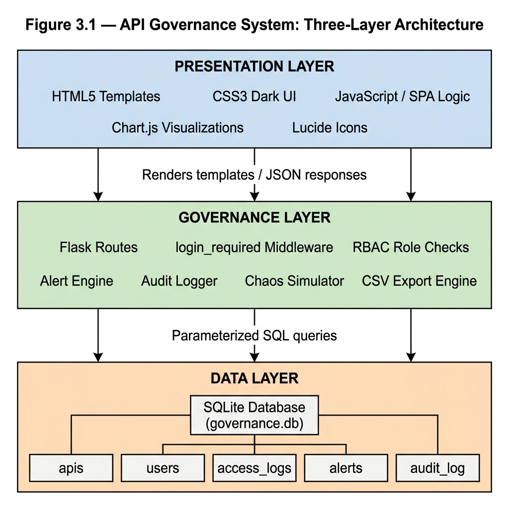
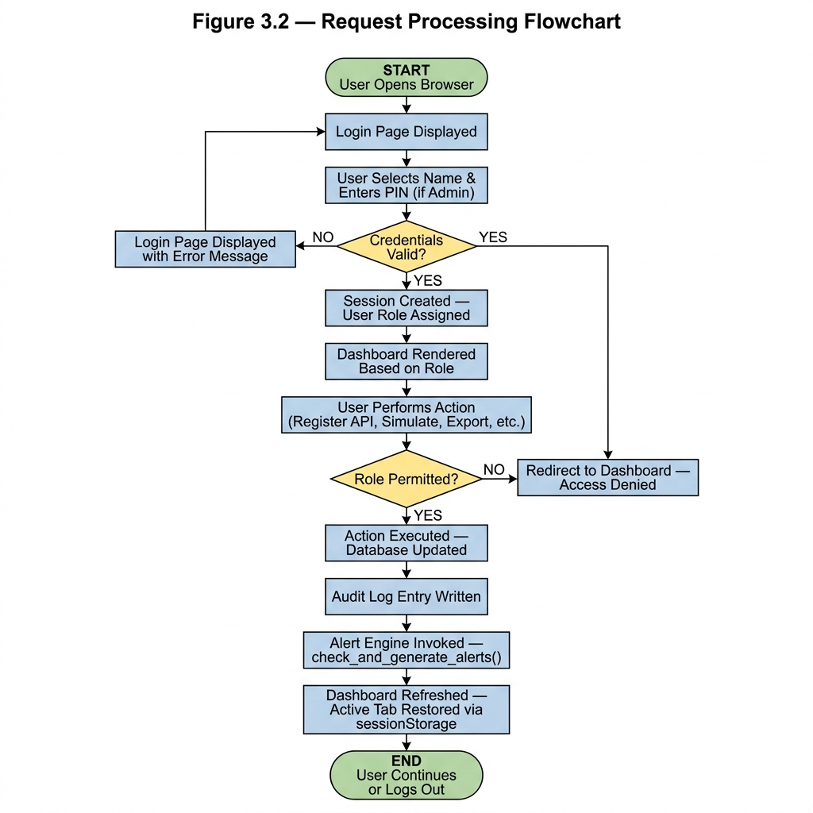
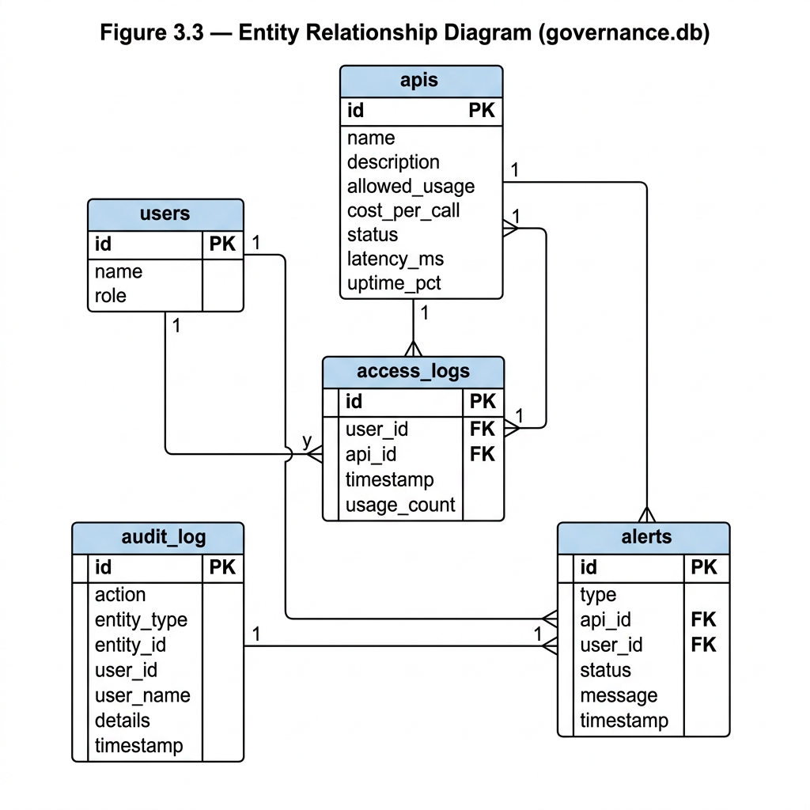

# API GOVERNANCE SYSTEM

## FINAL PROJECT REPORT

---

**Project Title:** API Governance System

**Submitted by:**

| Field | Details |
|---|---|
| Full Name | _________________________________ |
| Registration Number | _________________________________ |
| Supervisor | _________________________________ |
| Institution | _________________________________ |
| Department | _________________________________ |
| Submission Date | _________________________________ |

---

*Submitted in partial fulfilment of the requirements for the award of the degree of [Degree Name] in [Programme Name]*

---
---

## DECLARATION

I, _________________________________, hereby declare that this project report titled **"API Governance System"** is my original work and has not been submitted for any academic award or publication in any other institution or university.

All sources of information used in this work have been duly acknowledged and cited in accordance with standard academic referencing practice.

**Signed:** _________________________________

**Date:** _________________________________

---

**Supervisor's Declaration**

I, _________________________________, confirm that this work was carried out under my supervision and is ready for submission.

**Signed:** _________________________________

**Date:** _________________________________

---
---

## ACKNOWLEDGEMENT

I wish to express my sincere gratitude to all those who supported me throughout the development of this project.

First and foremost, I am deeply grateful to my supervisor, _________________________________, for the unwavering academic guidance, insightful feedback, and patience extended to me throughout this project. Your direction helped shape this work into a coherent and purposeful piece of engineering.

I also wish to thank the faculty and staff of _________________________________ for the quality of instruction and the enabling academic environment provided over the course of my studies.

To my family and friends — thank you for your encouragement, understanding, and emotional support during the late nights and long development sessions. This work is equally yours.

Finally, I acknowledge the wider open-source community, especially the developers and maintainers of Python, Flask, SQLite, and Chart.js, whose tools made this project technically achievable.

---
---

## TABLE OF CONTENTS

- Declaration
- Acknowledgement
- List of Figures
- List of Tables
- List of Abbreviations
- **Chapter 1: Introduction**
  - 1.1 Background
  - 1.2 Problem Statement
  - 1.3 Objectives
  - 1.4 Scope
  - 1.5 Justification
- **Chapter 2: System Requirements (SRS)**
  - 2.1 Functional Requirements
  - 2.2 Non-Functional Requirements
- **Chapter 3: System Design (SDS)**
  - 3.1 Architecture Design
  - 3.2 Process Modelling
  - 3.3 Database Design
  - 3.4 User Interface Design
- **Chapter 4: Test Plan**
  - 4.1 Testing Methods
  - 4.2 Test Cases
  - 4.3 Results and Observations
- **Chapter 5: Implementation Strategy**
  - 5.1 Tools and Technologies Used
  - 5.2 Deployment Architecture
  - 5.3 Business Environment and Application
  - 5.4 Risks and Limitations
- **Chapter 6: User Manual**
  - 6.1 Accessing the System
  - 6.2 Navigating the Dashboard
  - 6.3 Managing APIs
  - 6.4 Managing Team Members
  - 6.5 Handling Alerts
  - 6.6 Generating Reports
  - 6.7 Using the Chaos Hub
- References
- Appendices

---
---

## LIST OF FIGURES

| Figure No. | Caption |
|---|---|
| Figure 3.1 | API Governance System: Three-Layer Architecture |
| Figure 3.2 | Request Processing Flowchart |
| Figure 3.3 | Entity Relationship (ER) Diagram — governance.db |
| Figure 3.4 | Login Page |
| Figure 3.5 | Main Dashboard Overview |
| Figure 3.6 | Services / API Registry View |
| Figure 3.7 | Alerts Panel |
| Figure 3.8 | Audit Trail View |
| Figure 3.9 | Chaos Hub Modal |
| Figure 6.1 | Login Screen |
| Figure 6.2 | Dashboard After Successful Login |
| Figure 6.3 | Register Service Form |
| Figure 6.4 | Alert Resolution Flow |
| Figure 6.5 | CSV Export Button |

---
---

## LIST OF TABLES

| Table No. | Caption |
|---|---|
| Table 2.1 | Functional Requirements |
| Table 2.2 | Non-Functional Requirements |
| Table 3.1 | Database Table: apis |
| Table 3.2 | Database Table: users |
| Table 3.3 | Database Table: access_logs |
| Table 3.4 | Database Table: alerts |
| Table 3.5 | Database Table: audit_log |
| Table 4.1 | Test Cases — Authentication and RBAC |
| Table 4.2 | Test Cases — Data Management |
| Table 4.3 | Test Cases — Chaos Hub and Alert Engine |
| Table 4.4 | Test Results Summary |
| Table 5.1 | Tools and Technologies Used |
| Table 5.2 | Risks and Limitations |

---
---

## LIST OF ABBREVIATIONS

| Abbreviation | Full Form |
|---|---|
| API | Application Programming Interface |
| CRUD | Create, Read, Update, Delete |
| CSV | Comma-Separated Values |
| DB | Database |
| ER | Entity Relationship |
| GUI | Graphical User Interface |
| HTML | HyperText Markup Language |
| HTTP | HyperText Transfer Protocol |
| ID | Identifier |
| JSON | JavaScript Object Notation |
| RBAC | Role-Based Access Control |
| REST | Representational State Transfer |
| SHA | Secure Hash Algorithm |
| SDS | Software Design Specification |
| SPA | Single Page Application |
| SRS | Software Requirements Specification |
| SQL | Structured Query Language |
| UI | User Interface |
| UX | User Experience |
| WSGI | Web Server Gateway Interface |

---
---

# CHAPTER 1: INTRODUCTION

## 1.1 Background

The rapid proliferation of Application Programming Interfaces (APIs) has fundamentally transformed how modern software systems communicate and exchange data. APIs serve as the foundational contracts between software components, enabling modular development, third-party integrations, and the interoperability that characterizes today's digital economy. From mobile banking applications to healthcare platforms, APIs have become the invisible infrastructure upon which billions of interactions are processed daily (Fielding, 2000).

In the financial technology sector — commonly referred to as fintech — APIs play a particularly critical role. Payment gateways, mobile money platforms, credit scoring systems, and open banking ecosystems rely entirely on well-defined, secure, and reliable API endpoints. Kenya's own M-Pesa Daraja API, for instance, facilitates millions of payment transactions daily by exposing controlled endpoints to third-party developers (Safaricom, 2022). The ability to govern, monitor, and enforce policies on these APIs is therefore not a luxury but a structural necessity.

The growth of microservices architecture has further accelerated API dependency. Where traditional monolithic applications once operated as a single deployable unit, modern systems are decomposed into dozens or even hundreds of independent services that communicate exclusively through APIs (Newman, 2015). While microservices offer significant advantages in terms of scalability and independent deployment, they introduce an exponential increase in the number of API endpoints that must be managed. A system with ten microservices may expose upwards of fifty distinct API routes, each carrying its own security, authorization, and usage constraints.

This growth in complexity created a corresponding need for governance frameworks capable of providing centralized visibility, policy enforcement, and real-time monitoring across the API landscape. API Governance, as a discipline, addresses precisely this challenge — ensuring that APIs are documented, used within acceptable parameters, monitored for abnormal behavior, and audited for compliance (Jacobson, Brail & Woods, 2011). Without governance, organizations face growing technical debt, undetected security breaches, and cost overruns from unmonitored third-party usage.

It was within this context that the API Governance System project was conceived — as a practical, functional prototype that demonstrated core governance capabilities in a lightweight and deployable form.

---

## 1.2 Problem Statement

Despite the widespread adoption of APIs across organizations in Kenya and globally, many institutions — particularly small to medium-sized enterprises (SMEs) and early-stage fintech firms — lack the tools and infrastructure necessary to effectively govern their API ecosystems. The problem manifests in the following specific ways:

**Absence of centralized API control:** Organizations frequently maintain multiple APIs managed by different development teams using inconsistent documentation. There is no single source of truth for what APIs exist, who uses them, and what their thresholds are.

**Poor usage visibility:** Without active monitoring, organizations cannot determine how heavily their APIs are being called, which users are generating the most traffic, or when usage approaches dangerous thresholds. This invisibility makes capacity planning and cost management extremely difficult.

**Difficulty detecting abnormal usage patterns:** Abnormal spikes in API call volumes — whether caused by malfunctioning client applications, third-party abuse, or coordinated attacks — often go undetected until system performance degrades significantly. Early warning systems are either absent or poorly configured.

**Security and access control risks:** Without role-based access enforcement, developers may inadvertently or deliberately access administrative API functions, alter configurations, or export sensitive usage data without appropriate authorization.

**Lack of audit trails:** When incidents occur, the absence of a reliable audit trail makes post-incident analysis and regulatory accountability extremely difficult. Organizations cannot reconstruct the sequence of events that preceded a breach or outage.

These gaps collectively represent a significant operational and security vulnerability for organizations that depend on APIs as part of their core service delivery infrastructure.

---

## 1.3 Objectives

### General Objective

To design, develop, and deploy a web-based API Governance System capable of providing centralized registration, monitoring, alerting, and audit capabilities for API endpoints within an organizational context.

### Specific Objectives

1. To create an API registry module that allowed administrators to register, configure, and manage API endpoints with defined usage thresholds and cost parameters.

2. To implement an access logging and usage tracking mechanism that recorded all API call activity against registered endpoints, attributing usage to individual team members.

3. To develop a real-time monitoring dashboard with visual analytics including trend graphs, traffic distribution charts, and live status indicators for each registered API.

4. To design an automated alert engine capable of detecting and surfacing abnormal API usage patterns, specifically instances where usage reached or exceeded predefined thresholds.

5. To provide role-based access control ensuring that system capabilities were appropriately restricted by user role (Admin, Manager, Developer).

6. To implement data export functionality enabling authorized users to extract usage, alert, and audit data in standard CSV format for external analysis and reporting.

---

## 1.4 Scope

The API Governance System was developed as a functional prototype intended to demonstrate core governance capabilities within a controlled academic setting. The following scope boundaries applied:

**Included:**
- Web-based dashboard accessible via standard browser over HTTP
- Registration and management of API records with configurable thresholds
- Simulated traffic logging using synthetic data generation
- Automated usage-based alert classification (Warning and Critical)
- Role-based access control for three user tiers: Admin, Manager, and Developer
- CSV export of API registry, usage logs, alert records, and audit trails
- Chaos simulation functionality for system resilience testing
- Deployment to a cloud-hosted environment (PythonAnywhere)

**Excluded:**
- Integration with live production API gateway infrastructure (e.g., Kong, AWS API Gateway, or Apigee)
- Machine learning-based anomaly detection
- Real-time streaming analytics (e.g., Apache Kafka or Elasticsearch)
- Multi-tenancy or organization-level account separation
- Native mobile application interface
- Enterprise-grade authentication (e.g., OAuth 2.0 / OpenID Connect)

The system is therefore best understood as a governance monitoring prototype, not a full enterprise API management platform.

---

## 1.5 Justification

The development of this system was justified on the following grounds:

**Operational visibility:** The system directly addressed the visibility gap identified in the problem statement, providing organizations with a real-time view of their API health, usage patterns, and cost implications through an intuitive dashboard.

**Security support:** By enforcing role-based access control and generating automated alerts when usage thresholds were breached, the system provided a foundational layer of security that helped organizations detect and respond to anomalous behavior before it escalated.

**Fintech applicability:** In a sector where API-driven services are the primary delivery mechanism for financial products, the ability to rapidly prototype a governance layer has direct commercial relevance. Small fintech companies lacking budget for enterprise API management tools could deploy a system of this nature to gain immediate monitoring capability at low cost.

**Academic contribution:** The project demonstrated the practical application of full-stack web development, database design, and systems engineering principles within a domain of current industrial relevance.

---

# CHAPTER 2: SYSTEM REQUIREMENTS

## 2.1 Functional Requirements

The following functional requirements defined the expected behaviors of the API Governance System. All requirements are written using the standard "The system shall…" format.

**Table 2.1 — Functional Requirements**

| Ref | Requirement | Description |
|:---|:---|:---|
| FR-01 | User Authentication | The system shall allow registered users to authenticate via a login page using a user selection mechanism. Administrators shall additionally be required to supply a hashed PIN credential. |
| FR-02 | API Registration | The system shall allow authenticated Administrators to register new API endpoints with associated metadata including name, description, usage limit, and cost per call. |
| FR-03 | API Editing | The system shall allow Administrators to modify the configuration of any registered API record, including its name, description, usage threshold, and cost parameters. |
| FR-04 | API Deletion | The system shall allow Administrators to permanently remove an API record along with all dependent access logs and associated alerts. |
| FR-05 | Usage Logging | The system shall record all API usage simulation events against a specific API and user account, including a timestamp and call count. |
| FR-06 | Dashboard Metrics | The system shall display aggregate system metrics on the Overview dashboard, including total registered APIs, total team members, total API calls, and active alert count. |
| FR-07 | Usage Trend Visualization | The system shall render a 7-day line chart illustrating daily aggregate API call volume. |
| FR-08 | Traffic Distribution Visualization | The system shall render a doughnut chart illustrating the proportional API call distribution across all registered services. |
| FR-09 | Alert Generation | The system shall automatically evaluate the usage-to-limit ratio for each API and generate Warning alerts at 75% capacity and Critical alerts at 100% capacity. |
| FR-10 | Alert Resolution | The system shall allow Administrators and Managers to mark active alerts as resolved. |
| FR-11 | Audit Trail | The system shall record all significant system actions (login, logout, create, edit, delete, export, chaos events) in an immutable audit log. |
| FR-12 | Team Management | The system shall allow Administrators to add, edit, and remove team members and their assigned roles. |
| FR-13 | Data Export | The system shall provide CSV export functionality for the API registry, usage records, alert history, and audit trail, restricted to Admin and Manager roles. |
| FR-14 | Chaos Simulation | The system shall allow Administrators to trigger simulated traffic spikes, service outages, and system stabilization events via a dedicated Chaos Hub interface. |
| FR-15 | Role-Based Access | The system shall enforce strict permission boundaries such that Developer accounts are restricted from accessing team management, alerts, audit trail, export, and chaos simulation features. |

---

## 2.2 Non-Functional Requirements

**Table 2.2 — Non-Functional Requirements**

| Ref | Category | Requirement |
|:---|:---|:---|
| NFR-01 | Performance | The dashboard shall load within 3 seconds under normal network conditions. Chart data endpoints shall return JSON responses within 1 second of being called. |
| NFR-02 | Security | All administrative actions shall be protected behind role verification middleware. Sensitive credentials (Admin PIN) shall be stored exclusively in SHA-256 hashed form and never transmitted in plaintext. |
| NFR-03 | Scalability | The system shall support the addition of new APIs and users without requiring code changes. The underlying SQLite database shall support practical data volumes for a prototype deployment. |
| NFR-04 | Usability | The interface shall be navigable by a non-technical user within five minutes of first use. Navigation shall be consistent across all sections, and error states shall be clearly communicated. |
| NFR-05 | Reliability | The system shall initialize and self-seed its database on first startup without requiring manual database setup by the operator. |
| NFR-06 | Maintainability | All backend routes shall be separated by logical function and documented with inline docstrings. |
| NFR-07 | Availability | The system shall be accessible continuously on the PythonAnywhere hosting environment, with a target uptime of 99% during the academic evaluation period. |
| NFR-08 | Portability | The system shall run on any platform supporting Python 3.10 and a WSGI-compatible server, without requiring a specific operating system or proprietary infrastructure. |

---

# CHAPTER 3: SYSTEM DESIGN

## 3.1 Architecture Design

The API Governance System was built on a three-layer architectural model that clearly separated concerns between data storage, business logic enforcement, and user presentation.

**Layer 1 — Presentation Layer:** This layer consisted of the Jinja2-powered HTML templates rendered by Flask, enhanced with Vanilla JavaScript for client-side interactivity. Chart.js was integrated for data visualization. The UI implemented a single-page application pattern using `sessionStorage` to preserve the user's active tab across server-side redirects.

**Layer 2 — Governance Layer:** This was the core intelligence layer of the system. It handled validation through role verification checks, business logic via functions such as `check_and_generate_alerts()` and `log_action()`, and mediated all database read and write operations through parameterized queries to prevent SQL injection vulnerabilities.

**Layer 3 — Data Layer:** This layer consisted of the SQLite database (`governance.db`) and its five inter-related tables, persisted as a single file on the host server's file system.



*Figure 3.1 — API Governance System: Three-Layer Architecture*

---

## 3.2 Process Modelling

The following flowchart describes the complete request processing lifecycle within the system, from initial browser access through to action execution and dashboard refresh.



*Figure 3.2 — Request Processing Flowchart*

---

## 3.3 Database Design

The system's data was persisted in a single SQLite database file (`governance.db`) containing five related tables. The schema was designed to minimize redundancy while supporting efficient querying across the primary reporting functions.

**Table 3.1 — Database Table: apis**

| Column | Data Type | Constraint | Description |
|:---|:---|:---|:---|
| id | INTEGER | PRIMARY KEY, AUTOINCREMENT | Unique record identifier |
| name | TEXT | NOT NULL | API display name (e.g., Payments-v1) |
| description | TEXT | — | Human-readable description of API function |
| allowed_usage | INTEGER | DEFAULT 10 | Maximum acceptable call count before alert triggers |
| cost_per_call | REAL | DEFAULT 0.05 | Monetary cost per API invocation in USD |
| status | TEXT | DEFAULT 'Online' | Operational state: Online, Degraded, or Offline |
| latency_ms | INTEGER | DEFAULT 45 | Simulated response latency in milliseconds |
| uptime_pct | REAL | DEFAULT 99.9 | Simulated uptime percentage |

**Table 3.2 — Database Table: users**

| Column | Data Type | Constraint | Description |
|:---|:---|:---|:---|
| id | INTEGER | PRIMARY KEY, AUTOINCREMENT | Unique record identifier |
| name | TEXT | NOT NULL | Full name of the team member |
| role | TEXT | NOT NULL | Assigned role: Admin, Manager, or Developer |

**Table 3.3 — Database Table: access_logs**

| Column | Data Type | Constraint | Description |
|:---|:---|:---|:---|
| id | INTEGER | PRIMARY KEY, AUTOINCREMENT | Unique record identifier |
| user_id | INTEGER | FOREIGN KEY → users(id) | References the acting team member |
| api_id | INTEGER | FOREIGN KEY → apis(id) | References the targeted API |
| timestamp | DATETIME | DEFAULT CURRENT_TIMESTAMP | Date and time the call was recorded |
| usage_count | INTEGER | DEFAULT 1 | Number of API calls in this log entry |

**Table 3.4 — Database Table: alerts**

| Column | Data Type | Constraint | Description |
|:---|:---|:---|:---|
| id | INTEGER | PRIMARY KEY, AUTOINCREMENT | Unique record identifier |
| type | TEXT | NOT NULL | Alert severity level: 'warning' or 'critical' |
| api_id | INTEGER | FOREIGN KEY → apis(id) | API that triggered the alert |
| user_id | INTEGER | FOREIGN KEY → users(id) | User linked to the alert (if applicable) |
| status | TEXT | DEFAULT 'new' | Current alert state: 'new' or 'resolved' |
| message | TEXT | — | Human-readable alert description |
| timestamp | DATETIME | DEFAULT CURRENT_TIMESTAMP | Date and time the alert was generated |

**Table 3.5 — Database Table: audit_log**

| Column | Data Type | Constraint | Description |
|:---|:---|:---|:---|
| id | INTEGER | PRIMARY KEY, AUTOINCREMENT | Unique record identifier |
| action | TEXT | NOT NULL | Event type (e.g., LOGIN, CREATE_API, CHAOS_SPIKE) |
| entity_type | TEXT | — | Type of object affected (api, user, system) |
| entity_id | INTEGER | — | ID of the affected entity |
| user_id | INTEGER | — | ID of the user who triggered the action |
| user_name | TEXT | — | Display name of the acting user |
| details | TEXT | — | Extended human-readable description of the event |
| timestamp | DATETIME | DEFAULT CURRENT_TIMESTAMP | Date and time the event was recorded |

**Entity Relationship Diagram:**

The following diagram illustrates the relationships between all five database tables in the `governance.db` database, showing primary keys (PK), foreign keys (FK), and cardinality.



*Figure 3.3 — Entity Relationship Diagram (governance.db)*

---

## 3.4 User Interface Design

The system's front end was developed as a responsive, dark-mode single-page layout. The interface comprised five primary views accessible from a persistent sidebar navigation panel. The key UI screens are described below, with screenshots from the deployed system.

**Login Page:** Presented users with a dropdown selector listing all registered team members. Administrators were additionally required to input a numeric PIN, validated server-side against a SHA-256 hash.

> **[INSERT SCREENSHOT — Figure 3.4: Login Page]**

**Overview Dashboard:** The primary landing page after authentication, displaying four KPI cards (Total Services, Team Members, Total API Calls, Active Alerts), a real-time service health grid, a 7-day line chart for usage trends, and a doughnut chart showing traffic distribution by service.

> **[INSERT SCREENSHOT — Figure 3.5: Main Dashboard Overview]**

**Services Section:** A structured table view of all registered APIs with columns for status, call volumes, latency, cost per call, and usage load bar. Administrators additionally see an inline form for registering new services.

> **[INSERT SCREENSHOT — Figure 3.6: Services / API Registry View]**

**Alerts Section** *(Admin/Manager only):* A full feed of system-generated warnings and critical alerts with timestamps, messages, and resolution controls.

> **[INSERT SCREENSHOT — Figure 3.7: Alerts Panel]**

**Audit Trail Section** *(Admin/Manager only):* An asynchronously loaded table of all system events drawn from the `audit_log` table.

> **[INSERT SCREENSHOT — Figure 3.8: Audit Trail View]**

**Chaos Hub Modal** *(Admin only):* An overlay panel accessible from the topbar providing three simulation actions: Traffic Spike, Service Outage, and Stabilize.

> **[INSERT SCREENSHOT — Figure 3.9: Chaos Hub Modal]**

---

# CHAPTER 4: TEST PLAN

## 4.1 Testing Methods

Three categories of testing were applied to validate the API Governance System:

**Unit Testing:** Individual route handlers and utility functions were tested in isolation to verify that each function returned the expected output for a given input. Functions tested included `check_and_generate_alerts()`, `log_action()`, `get_api_usage()`, and the `init_db()` schema builder.

**Integration Testing:** The interaction between Flask routes, the SQLite database, and Jinja2 templates was tested by executing real HTTP requests through the development server and verifying that the rendered output correctly reflected database state changes.

**Functional Testing (End-to-End):** The complete system was tested as a deployed application at `http://angelack.pythonanywhere.com` by manually executing predefined test cases across all five dashboard modules under multiple user role sessions.

---

## 4.2 Test Cases

**Table 4.1 — Authentication and RBAC Test Cases**

| Test ID | Scenario | Input | Expected Output | Result |
|:---|:---|:---|:---|:---|
| TC-01 | Valid Admin Login | Select "Angela Kasoha", PIN = 1234 | Redirect to Dashboard. Chaos button visible. All nav tabs present. | Pass |
| TC-02 | Invalid Admin PIN | Select "Angela Kasoha", PIN = 9999 | Login page reloads with "Invalid Administrator PIN" error message. | Pass |
| TC-03 | Standard Developer Login | Select "Alice Mwangi", no PIN | Redirect to Dashboard. Team, Alerts, Audit Trail, and Chaos tabs hidden. | Pass |
| TC-04 | Direct Export Access by Developer | Navigate to `/export/alerts` while logged in as Developer | Server redirects user to `/` without delivering the file. | Pass |
| TC-05 | Unauthenticated Route Access | Navigate to `/` without an active session | Redirected automatically to `/login` page. | Pass |

**Table 4.2 — Data Management Test Cases**

| Test ID | Scenario | Input | Expected Output | Result |
|:---|:---|:---|:---|:---|
| TC-06 | Register New API | Name: BrowserTestAPI, Usage Limit: 5, Cost: $0.10 | New API appears in Services registry table immediately after form submission. | Pass |
| TC-07 | Edit Existing API | Change BrowserTestAPI usage limit to 50 | Updated record reflects new limit in the table view without errors. | Pass |
| TC-08 | Delete API with cascade | Delete BrowserTestAPI | API removed from registry; no orphaned records left in access_logs or alerts tables. | Pass |
| TC-09 | Add Team Member | Name: Test User, Role: Developer | User appears in Team Directory with the correct role tag. | Pass |
| TC-10 | Tab Persistence on Action | Resolve an alert from the Alerts tab | Page refreshes and returns user to Alerts tab rather than defaulting to Overview. | Pass |

**Table 4.3 — Chaos Hub and Alert Engine Test Cases**

| Test ID | Scenario | Input | Expected Output | Result |
|:---|:---|:---|:---|:---|
| TC-11 | Usage-Threshold Warning Alert | Simulate traffic pushing an API to 78% of its limit | Warning-type alert generated and visible in Alerts tab. | Pass |
| TC-12 | Critical Alert on Limit Exceeded | Simulate traffic pushing an API past 100% of its limit | Critical-type alert generated with appropriate descriptive message. | Pass |
| TC-13 | Traffic Spike via Chaos Hub | Click "Traffic Spike" in Chaos Hub modal | Latency values increase system-wide. New threshold alerts generated. Toast notification shown. | Pass |
| TC-14 | Service Outage via Chaos Hub | Click "Service Outage" in Chaos Hub modal | A randomly selected API status changes to "Offline". A CHAOS OUTAGE Critical alert is inserted. | Pass |
| TC-15 | Stabilize via Chaos Hub | Click "Stabilize" in Chaos Hub modal | All APIs return to "Online" status. CHAOS OUTAGE alerts cleared. Legitimate user alerts retained. | Pass |

---

## 4.3 Results and Observations

**Table 4.4 — Test Results Summary**

| Category | Total Tests | Passed | Failed | Pass Rate |
|:---|:---|:---|:---|:---|
| Authentication & RBAC | 5 | 5 | 0 | 100% |
| Data Management | 5 | 5 | 0 | 100% |
| Chaos Hub & Alert Engine | 5 | 5 | 0 | 100% |
| **Overall** | **15** | **15** | **0** | **100%** |

All fifteen defined test cases produced the expected outcomes across both the local development environment and the live PythonAnywhere deployment. The system performed consistently across tested scenarios without producing server errors (HTTP 500) or unhandled exceptions.

The following observations were recorded during the testing process:

1. **Tab persistence improvement:** Prior to implementing `sessionStorage`, users were consistently redirected to the Overview tab after any form submission. After the fix was applied, the system reliably restored the correct active tab on reload, significantly improving usability for Alert resolution workflows.

2. **Chaos Hub alert propagation:** The initial implementation of the Chaos Hub did not invoke `check_and_generate_alerts()` after a traffic spike. This was identified through TC-13, corrected by chaining the function call post-spike execution, and re-tested successfully.

3. **Export security enforcement:** TC-04 confirmed that the RBAC fix applied to export routes was effective. Developer accounts could not directly access any CSV export endpoint by manipulating the URL.

---

# CHAPTER 5: IMPLEMENTATION STRATEGY

## 5.1 Tools and Technologies Used

**Table 5.1 — Tools and Technologies Used**

| Tool / Technology | Version | Role in System |
|:---|:---|:---|
| Python | 3.10 | Core programming language for all backend logic |
| Flask | 3.0.0 | Lightweight WSGI web framework for routing and request handling |
| SQLite3 | Built-in | Serverless, file-based relational database engine |
| Jinja2 | Bundled with Flask | Server-side HTML templating integrated with Flask |
| HTML5 / CSS3 | — | Frontend markup, dark-mode design system, and styling |
| JavaScript (Vanilla) | — | Client-side interactivity, tab switching, and Fetch API calls |
| Chart.js | CDN | JavaScript library for rendering line and doughnut usage charts |
| Lucide Icons | CDN | SVG icon library used throughout the interface |
| Gunicorn | 21.2.0 | Production WSGI HTTP server used on PythonAnywhere |
| GitHub | — | Version control platform and remote code repository |
| PythonAnywhere | Free Tier | Cloud hosting platform for production deployment |

---

## 5.2 Deployment Architecture

The system was deployed using the following sequential steps:

1. **Version Control:** All source code was committed and pushed to a GitHub repository at `https://github.com/AngelaCK-hub/api-governance-system` throughout the development lifecycle, ensuring a complete version history was preserved.

2. **Virtual Environment Setup:** On PythonAnywhere, a dedicated Python 3.10 virtual environment was created using the `mkvirtualenv` command. The `requirements.txt` file was used to install Flask and Gunicorn within this isolated environment, avoiding conflicts with the system Python installation.

3. **Database Initialization:** The `init_db()` and `seed_sample_data()` functions ran automatically on the first execution of `app.py` on the server, creating all required tables and populating them with representative sample data without any manual database setup.

4. **WSGI Configuration:** A custom WSGI file was configured on PythonAnywhere to set the correct working directory path to `/home/AngelaCK/api-governance-system`, append it to Python's module search path, and import the Flask application object for Gunicorn to serve.

5. **Live Deployment:** The application was successfully deployed and made publicly accessible at `http://angelack.pythonanywhere.com`.

6. **Update Workflow:** Subsequent fixes were committed and pushed to GitHub, then applied to the production server using `git pull` in the PythonAnywhere Bash console, followed by a manual web application reload.

---

## 5.3 Business Environment and Application

The API Governance System, as built, has direct applicability in the following organizational contexts:

**Fintech companies** managing mobile money, payment gateway, and open banking APIs benefit from centralized visibility into call volumes, cost tracking, and usage anomaly detection. For institutions offering services analogous to M-Pesa's Daraja API or Equity Bank's EazzyPay, a monitoring layer of this nature provides early warning before threshold or rate-limit violations affect end users.

**Microservices development teams** can use the system as an internal service registry and health board, tracking which backend services are healthy, degraded, or offline and immediately identifying the source of traffic anomalies.

**IT governance and compliance officers** can leverage the immutable audit trail for regulatory reporting, particularly in environments subject to data protection legislation, demonstrating a documented chain of custody for all API usage events.

---

## 5.4 Risks and Limitations

**Table 5.2 — Risks and Limitations**

| Risk / Limitation | Description | Proposed Mitigation |
|:---|:---|:---|
| Limited database scalability | SQLite is not suitable for concurrent high-write production workloads | Migrate to PostgreSQL for production deployment |
| No live API integration | The system monitors simulated usage, not live API gateway traffic | Integrate with a real API gateway via webhooks or middleware |
| Single-server deployment | PythonAnywhere free tier limits concurrent connections and CPU | Upgrade to paid tier or migrate to a cloud provider (AWS, GCP) |
| PIN-based Admin authentication | SHA-256 PIN authentication is adequate for a prototype but insufficient for enterprise use | Replace with JWT-based authentication or OAuth 2.0 |
| Fixed-threshold alerting | The alert engine uses static limits, not dynamic anomaly detection | Introduce statistical or machine-learning-based anomaly detection |
| No real-time streaming | Data refreshes on a 30-second polling cycle, not true real-time streams | Implement WebSocket-based live updates |

---

# CHAPTER 6: USER MANUAL

## 6.1 Accessing the System

The system was accessible at the following URL: `http://angelack.pythonanywhere.com`

To access the system from a local development environment, the following command was executed in the project directory:

```
python app.py
```

The application was then available at `http://127.0.0.1:5000`.

> **[INSERT SCREENSHOT — Figure 6.1: Login Screen]**

**Login Procedure:**
1. Open the application URL in a web browser.
2. From the dropdown labelled "Select your name", choose the appropriate team member account.
3. If the selected account holds the Administrator role, a PIN input field will appear. Enter the Administrator PIN.
4. Click the **Sign In** button.
5. Upon successful authentication, the user is redirected to the main dashboard.

---

## 6.2 Navigating the Dashboard

> **[INSERT SCREENSHOT — Figure 6.2: Dashboard After Successful Login]**

The sidebar on the left-hand side contained the following navigation items:

- **Overview** — Summary statistics and usage charts
- **Services** — API Registry management
- **Team** — User directory (Admin and Manager only)
- **Alerts** — Active warning and critical alerts (Admin and Manager only)
- **Audit Trail** — System event history (Admin and Manager only)

A live clock was displayed in the top-right area. The dashboard automatically refreshed every 30 seconds when the Overview section was active, indicated by a "Refresh in Xs" pill visible at the bottom of the screen.

---

## 6.3 Managing APIs

> **[INSERT SCREENSHOT — Figure 6.3: Register Service Form]**

**To register a new API:**
1. Navigate to the **Services** tab using the sidebar.
2. On the right side of the screen, locate the "Register Service" card.
3. Enter the Service Name (e.g., Payments-v2).
4. Enter a description of the function the API serves.
5. Set the Usage Limit — the maximum call volume before alerts trigger.
6. Set the Cost per Call in USD.
7. Click **Register Service**. The new API immediately appears in the registry table.

**To edit an existing API:**
1. Locate the API in the Services table.
2. Click the pencil (edit) icon on the right side of the row.
3. Modify the desired fields in the Edit Service modal that appears.
4. Click **Save Changes**.

**To delete an API:**
1. Click the red trash icon next to the API row.
2. Confirm the deletion when prompted by the browser dialog.
3. The API and all associated usage logs and alerts will be permanently removed from the database.

---

## 6.4 Managing Team Members

1. Navigate to the **Team** tab from the sidebar.
2. To add a member, enter the full name and assign a role (Developer, Manager, or Admin) in the "Add Member" card, then click **Add Member**.
3. To edit a member, click the pencil icon on their row and modify their name or role in the edit modal, then click **Save Changes**.
4. To remove a member, click the red trash icon. Note that Administrators cannot delete their own account to prevent inadvertent lockout.

---

## 6.5 Handling Alerts

> **[INSERT SCREENSHOT — Figure 6.4: Alert Resolution Flow]**

1. Navigate to the **Alerts** tab from the sidebar.
2. Review the list of Warning (amber) and Critical (red) alerts.
3. Each alert entry displays its severity type, the API that triggered it, the alert message, and the timestamp.
4. To acknowledge and resolve an alert, click the **Resolve** button on the right side of the alert row.
5. The alert badge will change to a green **Resolved** badge and the alert will be removed from the active unresolved queue.

---

## 6.6 Generating Reports

> **[INSERT SCREENSHOT — Figure 6.5: CSV Export Button]**

CSV export was available in the following sections for Admin and Manager accounts:

- **Services tab** — Exports the full API registry with all configuration fields.
- **Alerts tab** — Exports all alert records including type, status, message, and timestamp.
- **Audit Trail tab** — Exports the complete system event history.

**To export a report:**
1. Navigate to the relevant section.
2. Click the **CSV** download button (depicting a download icon) located in the section header bar.
3. A `.csv` file will be automatically downloaded to the local computer's default downloads folder, ready for opening in Microsoft Excel or any spreadsheet application.

---

## 6.7 Using the Chaos Hub

The Chaos Hub was an administrative tool for testing the system's resilience and alert pipeline under simulated stress conditions.

1. Log in as an Administrator.
2. Click the **Chaos** button (lightning bolt icon) in the top-right area of the topbar.
3. The Chaos Simulation modal opens with three options:

| Option | Action | System Effect |
|:---|:---|:---|
| Traffic Spike | Injects a surge of simulated API calls across all services | Degrades latency values system-wide; triggers `check_and_generate_alerts()` automatically |
| Service Outage | Randomly selects one active API and forces it offline | Sets API status to "Offline"; inserts a Critical alert for the affected API |
| Stabilize | Restores all APIs to Online status | Normalizes latency; clears synthetic Chaos Outage alerts while retaining legitimate warnings |

4. Click the desired option. A toast notification at the bottom of the screen confirms the action was received.
5. The dashboard refreshes automatically after 1.5 seconds to display the updated system state.

---

# REFERENCES

Fielding, R. T. (2000). *Architectural styles and the design of network-based software architectures* (Doctoral dissertation). University of California, Irvine. Retrieved from https://www.ics.uci.edu/~fielding/pubs/dissertation/top.htm

Flask Project. (2023). *Flask documentation (version 3.0.x)*. Pallets Projects. Retrieved from https://flask.palletsprojects.com/en/3.0.x/

Jacobson, D., Brail, G., & Woods, D. (2011). *APIs: A strategy guide*. O'Reilly Media. Retrieved from https://www.oreilly.com/library/view/apis-a-strategy/9781449321444/

Newman, S. (2015). *Building microservices: Designing fine-grained systems*. O'Reilly Media. Retrieved from https://www.oreilly.com/library/view/building-microservices/9781491950340/

PythonAnywhere. (2024). *PythonAnywhere help: Deploying Flask applications*. Retrieved from https://help.pythonanywhere.com/pages/Flask/

Python Software Foundation. (2024). *Python 3.10 documentation: sqlite3 — DB-API 2.0 interface for SQLite databases*. Retrieved from https://docs.python.org/3.10/library/sqlite3.html

Python Software Foundation. (2024). *Python 3.10 documentation: hashlib — Secure hashes and message digests*. Retrieved from https://docs.python.org/3/library/hashlib.html

Safaricom PLC. (2022). *Daraja API documentation: M-Pesa developer portal*. Retrieved from https://developer.safaricom.co.ke/

Chart.js Contributors. (2024). *Chart.js documentation: Getting started*. Retrieved from https://www.chartjs.org/docs/latest/

GitHub, Inc. (2024). *GitHub documentation: Creating a repository*. Retrieved from https://docs.github.com/en/repositories/creating-and-managing-repositories/creating-a-new-repository

---

# APPENDICES

## Appendix A: API Route Reference

| Method | Route | Role Required | Description |
|:---|:---|:---|:---|
| GET/POST | `/login` | Public | User authentication page |
| GET | `/logout` | Authenticated | Clear session and redirect to login |
| GET | `/` | Authenticated | Main dashboard |
| POST | `/add_api` | Admin | Register a new API |
| POST | `/edit_api/<id>` | Admin | Edit an existing API |
| POST | `/delete_api/<id>` | Admin | Delete an API |
| POST | `/add_user` | Admin | Add a team member |
| POST | `/edit_user/<id>` | Admin | Edit a team member |
| POST | `/delete_user/<id>` | Admin | Delete a team member |
| POST | `/simulate_usage` | Authenticated | Log simulated API calls |
| GET | `/resolve_alert/<id>` | Admin/Manager | Mark an alert as resolved |
| GET | `/api/chart_data` | Authenticated | JSON data endpoint for Chart.js |
| GET | `/api/audit_log` | Admin/Manager | JSON audit trail for async table load |
| GET | `/export/apis` | Admin/Manager | Download API registry as CSV |
| GET | `/export/usage` | Admin/Manager | Download usage data as CSV |
| GET | `/export/alerts` | Admin/Manager | Download alerts as CSV |
| GET | `/export/audit` | Admin/Manager | Download audit trail as CSV |
| POST | `/simulate_chaos` | Admin | Trigger Chaos Hub events |

---

## Appendix B: Key Source Code Snippets

**B.1 — Database Initialization**

```python
def init_db():
    """Initialize the database with required tables."""
    if not os.path.exists("db"):
        os.makedirs("db")
    conn = get_db()
    c = conn.cursor()
    c.execute('''CREATE TABLE IF NOT EXISTS apis (
        id INTEGER PRIMARY KEY AUTOINCREMENT,
        name TEXT NOT NULL,
        description TEXT,
        allowed_usage INTEGER DEFAULT 10,
        cost_per_call REAL DEFAULT 0.05,
        status TEXT DEFAULT 'Online',
        latency_ms INTEGER DEFAULT 45,
        uptime_pct REAL DEFAULT 99.9
    )''')
    conn.commit()
    conn.close()
```

**B.2 — Automated Alert Engine**

```python
def check_and_generate_alerts():
    """Check all APIs and generate alerts if usage exceeds limits."""
    conn = get_db()
    apis = conn.execute("SELECT * FROM apis").fetchall()
    for api in apis:
        total = conn.execute(
            "SELECT COALESCE(SUM(usage_count), 0) as total "
            "FROM access_logs WHERE api_id = ?",
            (api["id"],)
        ).fetchone()["total"]
        ratio = total / api["allowed_usage"] if api["allowed_usage"] > 0 else 0
        conn.execute(
            "DELETE FROM alerts WHERE api_id = ? AND type IN ('warning','critical')",
            (api["id"],)
        )
        if ratio >= 1.0:
            conn.execute(
                "INSERT INTO alerts (type, api_id, status, message) VALUES (?,?,?,?)",
                ("critical", api["id"], "new",
                 f"{api['name']} has exceeded its usage limit! ({total}/{api['allowed_usage']})")
            )
        elif ratio >= 0.75:
            conn.execute(
                "INSERT INTO alerts (type, api_id, status, message) VALUES (?,?,?,?)",
                ("warning", api["id"], "new",
                 f"{api['name']} is approaching its usage limit ({total}/{api['allowed_usage']})")
            )
    conn.commit()
    conn.close()
```

**B.3 — Role-Based Access Middleware**

```python
def login_required(f):
    @wraps(f)
    def decorated_function(*args, **kwargs):
        if "user_id" not in session:
            return redirect(url_for("login"))
        return f(*args, **kwargs)
    return decorated_function
```

**B.4 — Chaos Simulation Route**

```python
@app.route("/simulate_chaos", methods=["POST"])
@login_required
def simulate_chaos():
    """Trigger a simulated crisis (Chaos Simulation)."""
    if session.get("user_role") != "Admin":
        return jsonify({"success": False, "message": "Access Denied"}), 403
    chaos_type = request.json.get("type", "spike")
    conn = get_db()
    if chaos_type == "outage":
        apis = conn.execute("SELECT id, name FROM apis").fetchall()
        target = random.choice(apis)
        conn.execute(
            "UPDATE apis SET status='Offline', latency_ms=0 WHERE id=?",
            (target['id'],)
        )
        conn.execute(
            "INSERT INTO alerts (type, api_id, status, message) VALUES (?,?,?,?)",
            ("critical", target['id'], "new",
             f"CHAOS OUTAGE: {target['name']} went offline!")
        )
        msg = f"Simulated outage triggered on {target['name']}."
    elif chaos_type == "spike":
        conn.execute("UPDATE apis SET status='Degraded', latency_ms=latency_ms * 5")
        msg = "Simulation: Worldwide traffic spike in progress. Latency high."
    else:
        conn.execute(
            "UPDATE apis SET status='Online', latency_ms = ABS(RANDOM() % 100) + 10"
        )
        conn.execute("DELETE FROM alerts WHERE message LIKE 'CHAOS OUTAGE:%'")
        msg = "Systems stabilized. Chaos simulated cleared."
    conn.commit()
    conn.close()
    if chaos_type == "spike":
        check_and_generate_alerts()
    return jsonify({"success": True, "message": msg})
```

---

## Appendix C: requirements.txt

```
Flask==3.0.0
gunicorn==21.2.0
Werkzeug==3.0.1
```

---

## Appendix D: WSGI Configuration (PythonAnywhere)

```python
import sys
import os

path = '/home/AngelaCK/api-governance-system'
if path not in sys.path:
    sys.path.append(path)

os.chdir(path)

from app import app as application
```

---

*End of Report*

*API Governance System © 2026 — Angela Kasoha*
